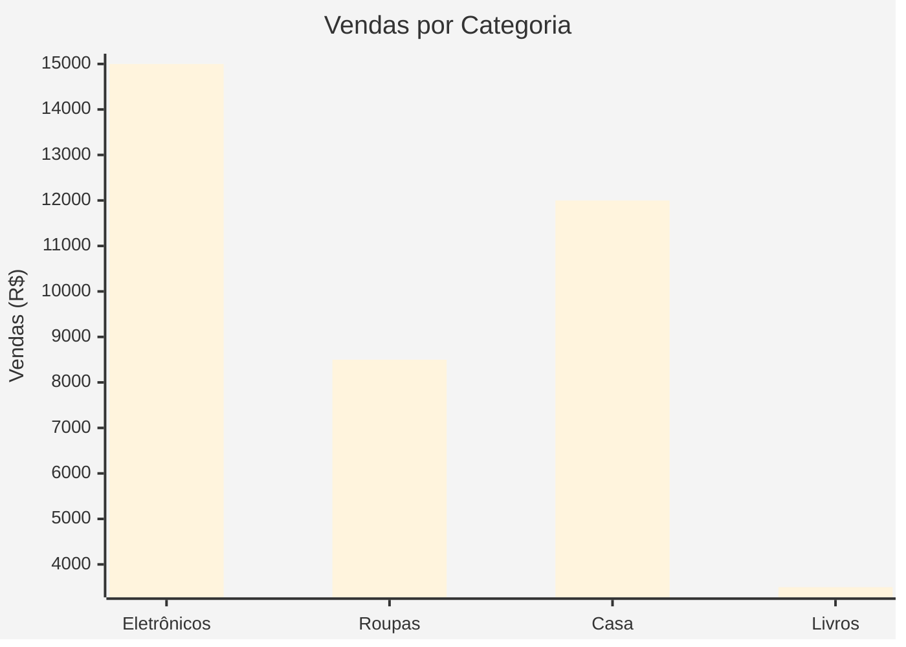

# 🧪 Teste da Nova Funcionalidade Mermaid

## 📝 Exemplo de Teste via Postman/cURL

### **1. Endpoint Principal (NL2SQL com Mermaid)**

```bash
curl -X POST http://localhost:3001/ai/nl2sql \
  -H "Content-Type: application/json" \
  -H "Authorization: Bearer SEU_TOKEN" \
  -d '{
    "query": "Mostrar vendas por categoria",
    "databaseId": 1,
    "sessionId": 123
  }'
```

### **2. Endpoint Dedicado Mermaid**

```bash
curl -X POST http://localhost:3001/ai/generate-mermaid \
  -H "Content-Type: application/json" \
  -H "Authorization: Bearer SEU_TOKEN" \
  -d '{
    "queryData": {
      "columns": ["categoria", "vendas", "mes"],
      "rows": [
        {"categoria": "Eletrônicos", "vendas": 15000, "mes": "Janeiro"},
        {"categoria": "Roupas", "vendas": 8500, "mes": "Janeiro"},
        {"categoria": "Casa", "vendas": 12000, "mes": "Janeiro"},
        {"categoria": "Livros", "vendas": 3500, "mes": "Janeiro"}
      ]
    },
    "databaseId": 1,
    "sessionId": 123
  }'
```

## 📊 Exemplo de Resposta Esperada

```json
{
  "success": true,
  "data": {
    "mermaid": "%%{init: {\"theme\":\"base\", \"themeVariables\": {\"primaryColor\":\"#4CAF50\"}}}%%\nxychart-beta\n    title \"Vendas por Categoria\"\n    x-axis [\"Eletrônicos\", \"Roupas\", \"Casa\", \"Livros\"]\n    y-axis \"Vendas (R$)\"\n    bar [15000, 8500, 12000, 3500]",
    "visualizationType": "bar",
    "chartTitle": "Vendas por Categoria",
    "dataStats": {
      "totalRows": 4,
      "totalColumns": 3,
      "dataTypes": {
        "categoria": "categorical",
        "vendas": "numeric",
        "mes": "categorical"
      },
      "hasNumericData": true,
      "hasCategoricalData": true,
      "hasDateData": false
    },
    "sessionId": 123,
    "interactionId": 456,
    "executionTime": 1234,
    "fromCache": false,
    "metadata": {
      "totalDataPoints": 4,
      "columnsAnalyzed": 3,
      "complexity": "simple"
    }
  }
}
```

## 🎨 Como o Mermaid Será Renderizado

O código Mermaid gerado:



Produzirá um **gráfico de barras colorido** com:
- ✅ Título claro
- ✅ Eixos rotulados
- ✅ Cores harmoniosas
- ✅ Dados proporcionais

## 🚀 Teste Rápido no Frontend

### **HTML Simples para Teste**

```html
<!DOCTYPE html>
<html>
<head>
    <title>Teste Mermaid</title>
    <script src="https://cdn.jsdelivr.net/npm/mermaid/dist/mermaid.min.js"></script>
</head>
<body>
    <h1>Visualização Gerada pelo Backend</h1>
    
    <div class="mermaid">
        %%{init: {"theme":"base", "themeVariables": {"primaryColor":"#4CAF50"}}}%%
        xychart-beta
            title "Vendas por Categoria"
            x-axis ["Eletrônicos", "Roupas", "Casa", "Livros"]
            y-axis "Vendas (R$)"
            bar [15000, 8500, 12000, 3500]
    </div>

    <script>
        mermaid.initialize({startOnLoad:true});
    </script>
</body>
</html>
```

## 🔧 Diferentes Tipos de Dados = Diferentes Visualizações

### **Dados Temporais** → Gráfico de Linha
```json
{
  "queryData": {
    "columns": ["data", "vendas"],
    "rows": [
      {"data": "2024-01-01", "vendas": 1000},
      {"data": "2024-02-01", "vendas": 1200},
      {"data": "2024-03-01", "vendas": 1100}
    ]
  }
}
```

### **Distribuição Categórica** → Gráfico de Pizza
```json
{
  "queryData": {
    "columns": ["categoria", "quantidade"],
    "rows": [
      {"categoria": "A", "quantidade": 30},
      {"categoria": "B", "quantidade": 45},
      {"categoria": "C", "quantidade": 25}
    ]
  }
}
```

### **Dados Relacionais** → Fluxograma
```json
{
  "queryData": {
    "columns": ["origem", "destino", "tipo"],
    "rows": [
      {"origem": "Início", "destino": "Processo A", "tipo": "fluxo"},
      {"origem": "Processo A", "destino": "Decisão", "tipo": "fluxo"},
      {"origem": "Decisão", "destino": "Fim", "tipo": "fluxo"}
    ]
  }
}
```

## ✨ Principais Melhorias Implementadas

1. **🎯 Análise Inteligente**: Detecta automaticamente o melhor tipo de visualização
2. **🎨 Visual Profissional**: Cores, temas e layouts otimizados
3. **📊 Múltiplos Tipos**: Bar, pie, line, flowchart, quadrant
4. **🔍 Validação**: Verifica sintaxe Mermaid antes de retornar
5. **💾 Cache Eficiente**: Armazena apenas visualizações de qualidade
6. **🛡️ Error Handling**: Mermaid de erro elegante quando algo falha
7. **📱 Responsivo**: Funciona perfeitamente em qualquer dispositivo

---

**🎉 Resultado**: Visualizações **Mermaid bonitas e apresentáveis** prontas para renderização direta no frontend!
