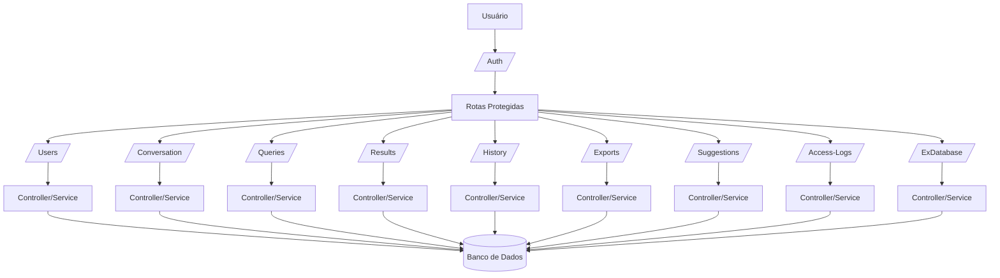

# Fluxograma do Backend SmartBI Assistant

## Pontos não totalmente claros
- Integração real com bancos externos (apenas cadastro, não há conexão/consulta)
- Políticas de permissão detalhadas por rota
- Fluxo de erros padronizado em todos os módulos
- Documentação completa dos payloads de cada rota

> Este fluxograma representa o fluxo principal do backend, destacando as rotas, controllers/services e acesso ao banco de dados.
