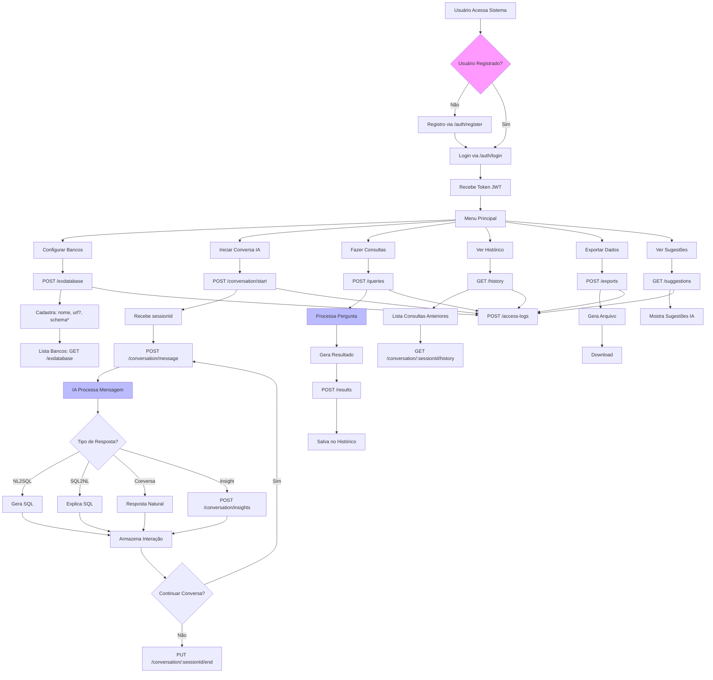

# Fluxo de Uso Completo da Plataforma SmartBI Assistant

## Análise do Fluxo de Uso

### ✅ Pontos que fazem sentido:
1. **Autenticação sequencial**: Registro → Login → Token
2. **Sessões de conversa**: Início → Mensagens → Fim
3. **Múltiplos tipos de interação**: NL2SQL, SQL2NL, Conversa, Insights
4. **Persistência**: Histórico, logs de acesso, resultados
5. **Funcionalidades auxiliares**: Exportação, sugestões

### ⚠️ Pontos que NÃO fazem sentido ou faltam:

#### 1. **Integração com Bancos Externos**
- ❌ `/exdatabase` apenas **cadastra** bancos, mas não há:
  - Rota para **testar conexão**
  - Rota para **executar queries** nos bancos externos
  - Validação se o schema fornecido está correto
  - Como a IA acessa esses bancos para gerar SQL real

#### 2. **Fluxo de NL2SQL Incompleto**
- ❌ IA gera SQL, mas **onde executa**?
- ❌ Como escolhe qual banco usar?
- ❌ Como retorna os dados reais?

#### 3. **Validação de Schema**
- ❌ Campo `schema` é obrigatório, mas não há validação
- ❌ Como a IA conhece as tabelas/colunas disponíveis?

#### 4. **Permissões e Segurança**
- ❌ Não há diferentes níveis de usuário
- ❌ Todos acessam todos os bancos?
- ❌ Como garantir que queries são read-only?

#### 5. **Fallback e Tratamento de Erros**
- ❌ Existe tabela `ai_fallbacks`, mas não há rotas para gerenciá-la
- ❌ Como configura respostas de fallback?

### 💡 Sugestões para completar o fluxo:

1. **Adicionar rotas em `/exdatabase`**:
   - `POST /:id/test` - Testar conexão
   - `POST /:id/execute` - Executar query
   - `GET /:id/schema` - Obter estrutura das tabelas

2. **Implementar seleção de banco**:
   - Permitir usuário escolher banco na conversa
   - IA sugerir banco baseado no contexto

3. **Adicionar rotas de configuração**:
   - `/admin/fallbacks` - Gerenciar respostas de fallback
   - `/admin/users` - Gerenciar permissões

4. **Melhorar validação**:
   - Validar schema ao cadastrar banco
   - Verificar se queries são read-only
