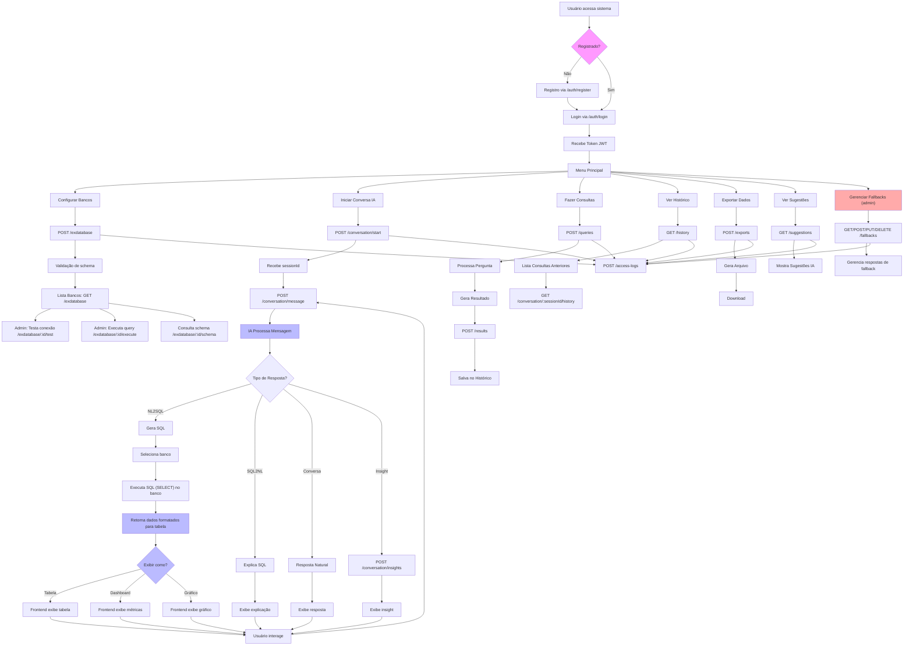

# Fluxo de Uso Completo da Plataforma SmartBI Assistant (Atualizado)

## Pontos resolvidos
- Integração real com bancos externos (testar, executar, schema)
- Seleção de banco para NL2SQL
- Retorno de dados prontos para tabela, dashboard ou gráfico
- Permissões admin/user
- Gerenciamento de fallbacks
- Validação de schema

> Este fluxograma representa o fluxo completo e atualizado do backend, incluindo os novos recursos implementados.
