# 🎨 Guia de Implementação - Visualização Mermaid

## 📋 Visão Geral

O **RCS-SmartBI-Assistant-backend** agora gera visualizações **Mermaid** otimizadas e bonitas, prontas para renderização no frontend. Este sistema substitui o markdown genérico por diagramas visuais específicos e apresentáveis.

## 🚀 Como Funciona

### 1. **Endpoint Principal**
```
POST /ai/nl2sql
```
Agora retorna `visualContent.mermaid` com código Mermaid pronto para uso.

### 2. **Endpoint Dedicado**
```
POST /ai/generate-mermaid
```
Endpoint específico para gerar apenas visualizações Mermaid.

## 📊 Exemplo de Resposta

### Antes (Markdown genérico):
```json
{
  "success": true,
  "data": {
    "visualContent": {
      "markdown": "# Dados\n\n| Nome | Valor |\n|------|-------|\n| A | 10 |"
    }
  }
}
```

### Agora (Mermaid específico):
```json
{
  "success": true,
  "data": {
    "visualContent": {
      "mermaid": "%%{init: {\"theme\":\"base\", \"themeVariables\": {\"primaryColor\":\"#4CAF50\"}}}%%\nxychart-beta\n    title \"Vendas por Categoria\"\n    x-axis [\"Jan\", \"Feb\", \"Mar\"]\n    y-axis \"Valores\"\n    bar [120, 150, 180]",
      "visualizationType": "bar",
      "chartTitle": "Vendas por Categoria",
      "dataStats": {
        "totalRows": 3,
        "totalColumns": 2,
        "hasNumericData": true
      }
    }
  }
}
```

## 🛠️ Tecnologias Recomendadas para Frontend

### **1. React com @mermaid-js/mermaid** ⭐ **RECOMENDADO**

```bash
npm install mermaid
```

```jsx
import { useEffect, useRef } from 'react';
import mermaid from 'mermaid';

const MermaidChart = ({ mermaidCode, title }) => {
  const chartRef = useRef(null);

  useEffect(() => {
    mermaid.initialize({
      startOnLoad: true,
      theme: 'base',
      securityLevel: 'loose',
      fontFamily: 'Arial, sans-serif'
    });

    if (chartRef.current) {
      chartRef.current.innerHTML = mermaidCode;
      mermaid.init(undefined, chartRef.current);
    }
  }, [mermaidCode]);

  return (
    <div className="mermaid-container">
      <h3>{title}</h3>
      <div ref={chartRef} className="mermaid">
        {mermaidCode}
      </div>
    </div>
  );
};

// Uso
<MermaidChart 
  mermaidCode={response.data.visualContent.mermaid}
  title={response.data.visualContent.chartTitle}
/>
```

### **2. Next.js com dynamic import**

```jsx
import dynamic from 'next/dynamic';

const MermaidChart = dynamic(() => import('../components/MermaidChart'), {
  ssr: false,
  loading: () => <p>Carregando gráfico...</p>
});
```

### **3. Vue.js com vue-mermaid**

```bash
npm install vue-mermaid-string
```

```vue
<template>
  <div>
    <h3>{{ chartTitle }}</h3>
    <mermaid :diagram="mermaidCode" />
  </div>
</template>

<script>
import Mermaid from 'vue-mermaid-string';

export default {
  components: { Mermaid },
  props: ['mermaidCode', 'chartTitle']
};
</script>
```

### **4. Angular com ngx-mermaid**

```bash
npm install ngx-mermaid mermaid
```

```typescript
import { Component, Input } from '@angular/core';

@Component({
  selector: 'app-mermaid-chart',
  template: `
    <h3>{{ chartTitle }}</h3>
    <div [mermaid]="mermaidCode"></div>
  `
})
export class MermaidChartComponent {
  @Input() mermaidCode: string;
  @Input() chartTitle: string;
}
```

## 🎨 Tipos de Visualização Suportados

### **1. Gráfico de Barras**

```mermaid
%%{init: {"theme":"base", "themeVariables": {"primaryColor":"#4CAF50"}}}%%
xychart-beta
    title "Vendas por Mês"
    x-axis ["Jan", "Feb", "Mar"]
    y-axis "Vendas"
    bar [120, 150, 180]
```


### **2. Gráfico de Pizza**

```mermaid
%%{init: {"pie": {"textPosition": 0.5}, "theme":"base"}}%%
pie title Distribuição por Categoria
    "Categoria A" : 42
    "Categoria B" : 30
    "Categoria C" : 28
```


### **3. Fluxograma**

```mermaid
flowchart TD
    A[Início] --> B{Condição}
    B -->|Sim| C[Ação 1]
    B -->|Não| D[Ação 2]
```


### **4. Gráfico de Linha**

```mermaid
%%{init: {"theme":"base", "themeVariables": {"primaryColor":"#2196F3"}}}%%
xychart-beta
    title "Evolução Temporal"
    x-axis ["Q1", "Q2", "Q3", "Q4"]
    y-axis "Valores"
    line [100, 120, 150, 140]
```


## 📝 Exemplo Completo de Integração

### **Frontend React**

```jsx
import React, { useState } from 'react';
import MermaidChart from './components/MermaidChart';

const DataVisualization = () => {
  const [visualization, setVisualization] = useState(null);
  const [loading, setLoading] = useState(false);

  const generateVisualization = async (queryData) => {
    setLoading(true);
    try {
      const response = await fetch('/api/ai/generate-mermaid', {
        method: 'POST',
        headers: {
          'Content-Type': 'application/json',
          'Authorization': `Bearer ${token}`
        },
        body: JSON.stringify({ queryData })
      });

      const result = await response.json();
      
      if (result.success) {
        setVisualization(result.data);
      }
    } catch (error) {
      console.error('Erro ao gerar visualização:', error);
    } finally {
      setLoading(false);
    }
  };

  return (
    <div className="visualization-container">
      {loading && <div>Gerando visualização...</div>}
      
      {visualization && (
        <div className="chart-container">
          <MermaidChart 
            mermaidCode={visualization.mermaid}
            title={visualization.chartTitle}
          />
          
          <div className="chart-metadata">
            <p>Tipo: {visualization.visualizationType}</p>
            <p>Dados: {visualization.dataStats?.totalRows} registros</p>
            <p>Colunas: {visualization.dataStats?.totalColumns}</p>
          </div>
        </div>
      )}
    </div>
  );
};

export default DataVisualization;
```

### **CSS para Styling**

```css
.mermaid-container {
  background: white;
  border-radius: 8px;
  padding: 20px;
  box-shadow: 0 2px 10px rgba(0,0,0,0.1);
  margin: 20px 0;
}

.mermaid-container h3 {
  text-align: center;
  color: #333;
  margin-bottom: 20px;
  font-size: 1.2em;
}

.mermaid {
  display: flex;
  justify-content: center;
  align-items: center;
  min-height: 300px;
}

.chart-metadata {
  margin-top: 15px;
  padding: 10px;
  background: #f5f5f5;
  border-radius: 4px;
  font-size: 0.9em;
  color: #666;
}
```

## 🔧 Configuração Avançada

### **Temas Personalizados**

```javascript
mermaid.initialize({
  theme: 'base',
  themeVariables: {
    primaryColor: '#4CAF50',
    primaryTextColor: '#fff',
    primaryBorderColor: '#388E3C',
    lineColor: '#666',
    sectionBkgColor: '#f9f9f9',
    altSectionBkgColor: '#e8f5e8',
    gridColor: '#ddd',
    c0: '#4CAF50',
    c1: '#2196F3',
    c2: '#FF9800',
    c3: '#E91E63'
  }
});
```

### **Responsividade**

```css
@media (max-width: 768px) {
  .mermaid-container {
    padding: 10px;
    margin: 10px 0;
  }
  
  .mermaid svg {
    max-width: 100%;
    height: auto;
  }
}
```

## 🎯 Benefícios da Nova Implementação

1. **🎨 Visual Atraente**: Gráficos coloridos e profissionais
2. **📱 Responsivo**: Funciona em desktop e mobile
3. **⚡ Performance**: Renderização otimizada
4. **🔧 Flexível**: Múltiplos tipos de visualização
5. **🎯 Específico**: Cada tipo de dado tem sua visualização ideal
6. **💾 Cache Inteligente**: Reduz chamadas desnecessárias
7. **🛡️ Robusto**: Tratamento de erros elegante

## 🚀 Próximos Passos

1. **Implementar** uma das tecnologias recomendadas
2. **Testar** com dados reais do seu sistema
3. **Personalizar** temas e cores da sua marca
4. **Otimizar** para sua arquitetura específica
5. **Expandir** com interatividade (zoom, filtros, etc.)

---

**🎉 Resultado**: Frontend com visualizações Mermaid **bonitas**, **interativas** e **profissionais**!
