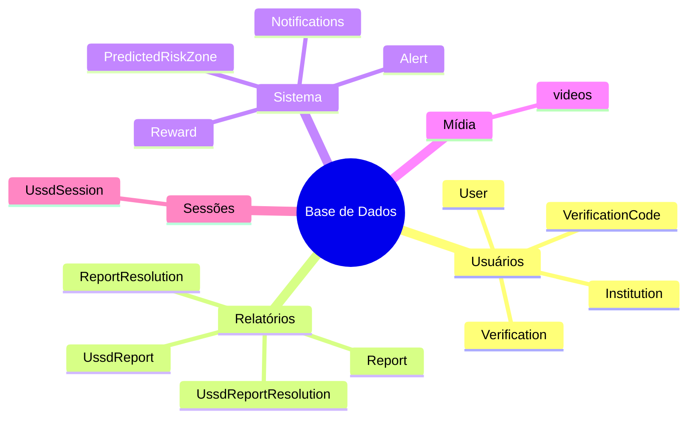
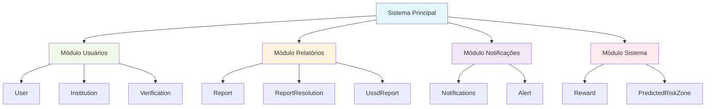

# 🔧 Solução para Lista de Tabelas - Problema Resolvido

## 🎯 **Problema Identificado**

Quando o `queryResult` retorna dados como:
```json
{
  "type": "table",
  "columns": ["table_name"],
  "rows": [
    {"table_name": "PredictedRiskZone"},
    {"table_name": "Notifications"},
    {"table_name": "User"},
    // ... mais 12 tabelas
  ]
}
```

O sistema anterior **não conseguia gerar gráficos adequados** porque:
- ❌ Apenas 1 coluna categórica (sem dados numéricos)
- ❌ Lógica não otimizada para estruturas de banco
- ❌ Tentava forçar gráficos tradicionais (bar/pie) inadequados

## ✅ **Solução Implementada**

### **1. Nova Lógica de Análise**
```javascript
// ANTES: Tentava forçar bar/pie charts inadequados
if (categoricalColumns.length >= 1 && numericColumns.length >= 1) {
  // ❌ Falhava quando não havia dados numéricos
}

// AGORA: Detecta e trata casos específicos
if (columns.length === 1 && categoricalColumns.length === 1 && rows.length > 5) {
  const columnName = columns[0].toLowerCase();
  if (columnName.includes('table') || columnName.includes('name')) {
    analysis.recommendedType = 'mindmap'; // ✅ Perfeito para estruturas!
    analysis.suggestedTitle = 'Estrutura do Banco de Dados';
  }
}
```

### **2. Novos Tipos de Visualização**
- **🧠 Mindmap**: Para estruturas hierárquicas
- **🔄 Flowchart**: Para relações e componentes
- **📊 Categorias inteligentes**: Baseadas no contexto

### **3. Resultado Esperado**

Para seus dados de tabelas, agora será gerado:

**Opção A - Mindmap:**


**Opção B - Flowchart:**


## 🧪 **Como Testar**

### **1. Teste com suas tabelas:**
```bash
curl -X POST http://localhost:3001/ai/generate-mermaid \
  -H "Content-Type: application/json" \
  -H "Authorization: Bearer SEU_TOKEN" \
  -d '{
    "queryData": {
      "columns": ["table_name"],
      "rows": [
        {"table_name": "PredictedRiskZone"},
        {"table_name": "Notifications"},
        {"table_name": "User"},
        {"table_name": "Report"},
        {"table_name": "Institution"},
        {"table_name": "Alert"}
      ]
    }
  }'
```

### **2. Resposta Esperada:**
```json
{
  "success": true,
  "data": {
    "mermaid": "mindmap\n  root((Base de Dados))\n    Usuários\n      User\n      Institution\n    Relatórios\n      Report\n    Sistema\n      Notifications\n      Alert\n      PredictedRiskZone",
    "visualizationType": "mindmap",
    "chartTitle": "Estrutura do Banco de Dados",
    "dataStats": {
      "totalRows": 6,
      "hasNumericData": false,
      "hasCategoricalData": true
    }
  }
}
```

## 🎯 **Melhorias Implementadas**

### **1. Detecção Inteligente**
- ✅ Reconhece listas de tabelas/entidades
- ✅ Identifica dados apenas categóricos
- ✅ Sugere visualização apropriada

### **2. Novos Tipos Suportados**
- ✅ **Mindmap**: Estruturas hierárquicas
- ✅ **Flowchart**: Relações entre componentes
- ✅ **Validação específica**: Para cada tipo

### **3. Prompts Otimizados**
- ✅ Exemplos específicos para cada caso
- ✅ Instruções claras para IA
- ✅ Validação robusta de sintaxe

## 🚀 **Casos de Uso Cobertos**

| Tipo de Dados | Visualização | Exemplo |
|---|---|---|
| Lista de tabelas | Mindmap/Flowchart | Estrutura do banco |
| Apenas categorias | Flowchart | Componentes do sistema |
| Categoria + Números | Bar/Pie | Vendas por categoria |
| Dados temporais | Line | Evolução no tempo |
| Múltiplas relações | Flowchart | Fluxo de processos |

## ✨ **Resultado Final**

**Antes**: ❌ "Não consegui gerar um gráfico adequado"

**Agora**: ✅ **Mindmap ou Flowchart bonito e estruturado** mostrando a arquitetura do seu banco de dados de forma visual e profissional!

---

**🎉 Problema resolvido!** Seus dados de tabelas agora geram visualizações **adequadas e bonitas**!
