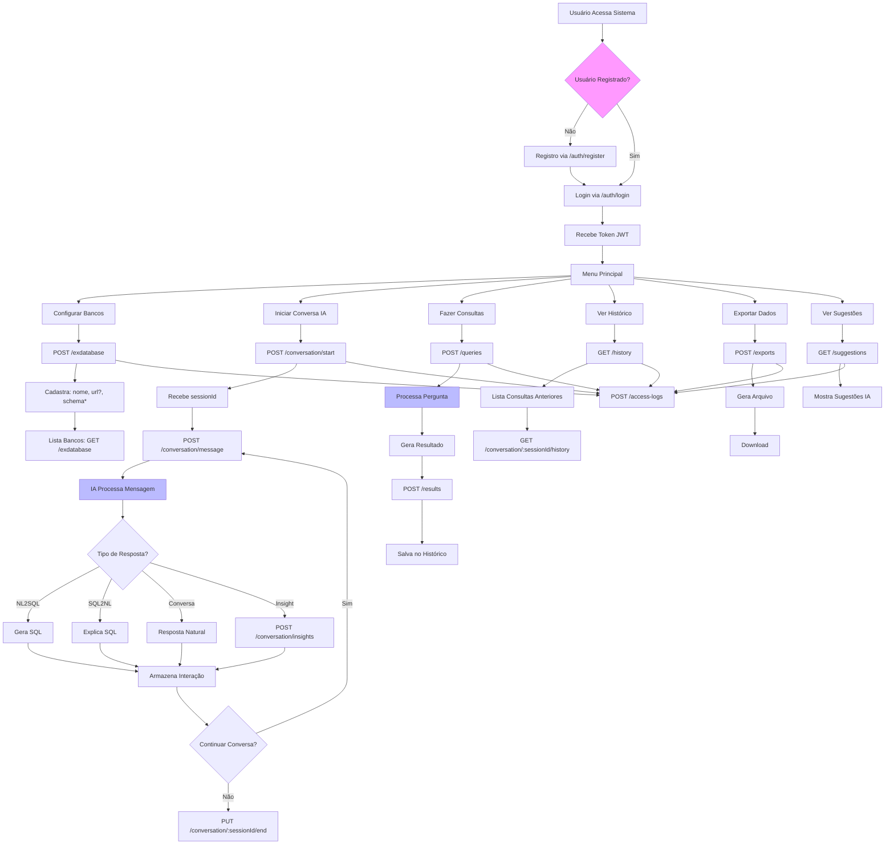

# Fluxo de Uso Completo da Plataforma SmartBI Assistant

```mermaid
flowchart TD
    A[Usuário Acessa Sistema] --> B{Usuário Registrado?}
    B -->|Não| C[Registro via /auth/register]
    B -->|Sim| D[Login via /auth/login]
    C --> D
    D --> E[Recebe Token JWT]
    E --> F[Menu Principal]
    
    F --> G[Configurar Bancos]
    F --> H[Iniciar Conversa IA]
    F --> I[Fazer Consultas]
    F --> J[Ver Histórico]
    F --> K[Exportar Dados]
    F --> L[Ver Sugestões]
    
    %% Fluxo de Configuração de Bancos
    G --> G1[POST /exdatabase]
    G1 --> G2[Cadastra: nome, url?, schema*]
    G2 --> G3[Lista Bancos: GET /exdatabase]
    
    %% Fluxo de Conversa IA
    H --> H1[POST /conversation/start]
    H1 --> H2[Recebe sessionId]
    H2 --> H3[POST /conversation/message]
    H3 --> H4[IA Processa Mensagem]
    H4 --> H5{Tipo de Resposta?}
    H5 -->|NL2SQL| H6[Gera SQL]
    H5 -->|SQL2NL| H7[Explica SQL]
    H5 -->|Conversa| H8[Resposta Natural]
    H5 -->|Insight| H9[POST /conversation/insights]
    H6 --> H10[Armazena Interação]
    H7 --> H10
    H8 --> H10
    H9 --> H10
    H10 --> H11{Continuar Conversa?}
    H11 -->|Sim| H3
    H11 -->|Não| H12[PUT /conversation/:sessionId/end]
    
    %% Fluxo de Consultas Diretas
    I --> I1[POST /queries]
    I1 --> I2[Processa Pergunta]
    I2 --> I3[Gera Resultado]
    I3 --> I4[POST /results]
    I4 --> I5[Salva no Histórico]
    
    %% Fluxo de Histórico
    J --> J1[GET /history]
    J1 --> J2[Lista Consultas Anteriores]
    J2 --> J3[GET /conversation/:sessionId/history]
    
    %% Fluxo de Exportação
    K --> K1[POST /exports]
    K1 --> K2[Gera Arquivo]
    K2 --> K3[Download]
    
    %% Fluxo de Sugestões
    L --> L1[GET /suggestions]
    L1 --> L2[Mostra Sugestões IA]
    
    %% Todos os fluxos registram logs
    G1 --> M[POST /access-logs]
    H1 --> M
    I1 --> M
    J1 --> M
    K1 --> M
    L1 --> M
    
    style B fill:#f9f
    style H4 fill:#bbf
    style I2 fill:#bbf
```