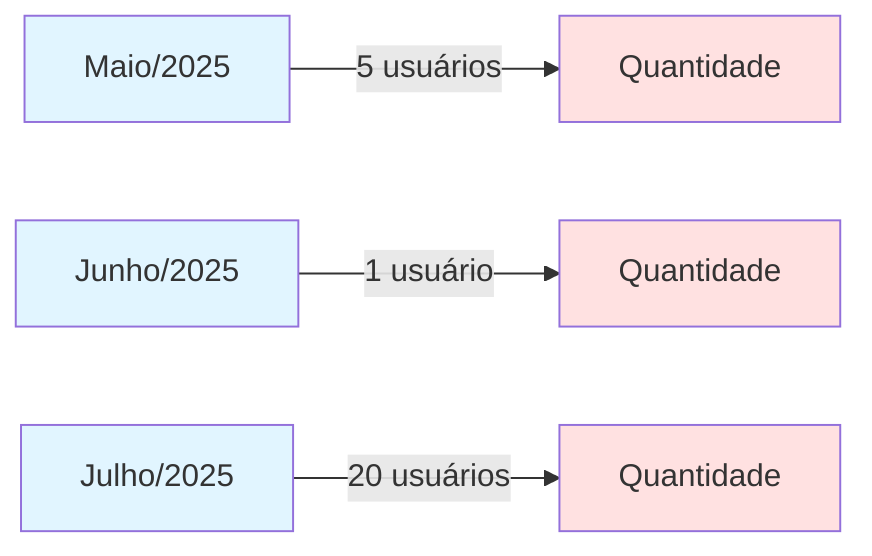

```mermaid
graph LR
    A[Maio/2025] -->|5 usuários| B[Quantidade]
    C[Junho/2025] -->|1 usuário| D[Quantidade]
    E[Julho/2025] -->|20 usuários| F[Quantidade]
    
    style A fill:#e1f5ff
    style C fill:#e1f5ff
    style E fill:#e1f5ff
    style B fill:#ffe1e1
    style D fill:#ffe1e1
    style F fill:#ffe1e1
```